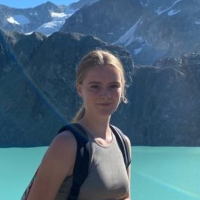

```{r setup, include=FALSE}
library(flexdashboard)
library(readr)
library(leaflet)
library(DT)
library(tidyverse)
library(lubridate)
library(plotly)
library(spotifyr)
library(Cairo)
library(compmus)

Sys.setenv(SPOTIFY_CLIENT_ID = 'c6d2017616c34106a1b1c8407f7fbc6e')
Sys.setenv(SPOTIFY_CLIENT_SECRET = '1bee2b2375da4f9a9332a114d31d0da7')
access_token <- get_spotify_access_token()

otra1 <- get_playlist_audio_features("", "6cZQQaJ0MsSHyUfGyuLgGK")

otra_j <- otra1 %>%
  filter(added_by.id == '1153531084') %>%
  mutate(added_by.id = "Julia")

otra_w <- otra1 %>%
  filter(added_by.id == '1168120441') %>%
  mutate(added_by.id = "Willemijn")

otra_r <- otra1 %>%
  filter(added_by.id == 'roos.hutter') %>%
  mutate(added_by.id = "Roos")

otra <- rbind(head(otra_r, 52), otra_w, head(otra_j, 52))
```

### Introduction to the 'On the road (again)' corpus
For this computational musicological analysis I'm going to use a shared playlist between my sisters and I, called 'On the road (again)'. Down below you can see a picture of Julia, Willemijn and me (Roos). This playlist was used on vacation last year to combine our different tastes in music. Therefore the focus will be on the differences and similarities between the songs each of us put in the playlist. I think it will be interesting to analyze the different genres of the songs. Additionally, the energy the songs have is an interesting aspect to look more into. Because they are my sister, I already have some speculations about these differences. However, it still will be worth looking into. I expect the artists and release dates of the songs the be different. Also, the similarities between the songs will be interesting to discover. Since this playlist was made to listen to during car rides, I expect the songs to have somewhat of a similar sound. Furthermore, my sisters and I do influence each others music taste a little bit. I hope to discover more about who influences who and in what way exactly.

***
{width=150} 

{width=150} 

{width=150}

### Visualisation of the Acousticness

```{r}

plot_acousticness <- ggplot(otra, aes(x=added_by.id, y=acousticness)) +
  geom_boxplot() +
  labs(x = '', y = "Acousticness", title = "Acousticness") +
  theme_light()

ggplotly(plot_acousticness)

```

***
This plot is a boxplot about the acousticness of the songs added by Julia, Willemijn and Roos. You can clearly see that I have songs which are the most acoustic. It's interesting to see that Julia and Willemijn have similar acousticness.

### Visualisation of the Energy, Valence and Mode

```{r}
otra_evm <- otra %>%
  mutate(
    mode = ifelse(mode == 0, "Minor", "Major")
  )

plot_evm <- ggplot(otra_evm,
    aes(
      x = valence,
      y = energy,
      size = loudness,
      colour = mode
    )
  ) +
  geom_point() +              # Scatter plot.
  geom_rug(linewidth = 0.1) + # Add 'fringes' to show data distribution.
  facet_wrap(~ added_by.id) +    # Separate charts per playlist.
  scale_x_continuous(         # Fine-tune the x axis.
    limits = c(0, 1),
    breaks = c(0, 0.50, 1),   # Use grid-lines for quadrants only.
    minor_breaks = NULL       # Remove 'minor' grid-lines.
  ) +
  scale_y_continuous(         # Fine-tune the y axis in the same way.
    limits = c(0, 1),
    breaks = c(0, 0.50, 1),
    minor_breaks = NULL
  ) +
  scale_colour_brewer(        # Use the Color Brewer to choose a palette.
    type = "qual",            # Qualitative set.
    palette = "Paired"        # Name of the palette is 'Paired'.
  ) +
  scale_size_continuous(      # Fine-tune the sizes of each point.
    trans = "exp",            # Use an exp transformation to emphasise loud.
    guide = "none"            # Remove the legend for size.
  ) +
  theme_light() +             # Use a simpler theme.
  labs(                       # Make the titles nice.
    x = "Valence",
    y = "Energy",
    colour = "Mode",
    title = "Energy, Valence and Mode"
  )

ggplotly(plot_evm)
```

***
This plot contains information about the energy, valence and mode of the songs added by Julia, Willemijn and Roos. I think it's interesting that the energy of most songs are high. However you can see that Willemijn has the most songs with high energy, which I expected. Another interesting point is that Julia and Willemijn have similarities between energy, valence and mode, their plot looks kind of the same. However mine (Roos) looks very different, my songs are more spread out and have less energy. 

### Chromagrams of two versions of Crazy Little Thing Called Love
```{r}
chroma <-
  get_tidy_audio_analysis("5aYJ6gZyTFxZPAyTRRWKxP") |>
  select(segments) |>
  unnest(segments) |>
  select(start, duration, pitches)

chroma <- chroma %>%
  mutate(pitches = map(pitches, compmus_normalise, "euclidean")) %>%
  compmus_gather_chroma() 
  
plot_chroma <-
  ggplot(chroma,
    aes(
      x = start + duration / 2,
      width = duration,
      y = pitch_class,
      fill = value
    )
  ) +
  geom_tile() +
  labs(x = "Time (s)", y = NULL, fill = "Magnitude") +
  theme_minimal() +
  scale_fill_viridis_c()

chroma2 <-
  get_tidy_audio_analysis("6xdLJrVj4vIXwhuG8TMopk") |>
  select(segments) |>
  unnest(segments) |>
  select(start, duration, pitches)

chroma2 <- chroma2 %>%
  mutate(pitches = map(pitches, compmus_normalise, "euclidean")) %>%
  compmus_gather_chroma() 
  
plot_chroma2 <-
  ggplot(chroma2,
    aes(
      x = start + duration / 2,
      width = duration,
      y = pitch_class,
      fill = value
    )
  ) +
  geom_tile() +
  labs(x = "Time (s)", y = NULL, fill = "Magnitude") +
  theme_minimal() +
  scale_fill_viridis_c()

subplot(plot_chroma, plot_chroma2, nrows = 2, margin = 0.04, heights = c(0.5, 0.5)) %>% layout(annotations = 
list(list(x = 0.5,  y = 1.0,  
          text = "Crazy Little Thing Called Love - Acoustic Version - Maroon 5",   
    xref = "paper",  
    yref = "paper",  
    xanchor = "center",  
    yanchor = "bottom",  
    showarrow = FALSE ),        list(x = 0.5, y = 0.45,  
          text = "Crazy Little Thing Called Love - Remastered 2011 - Queen",   
    xref = "paper",  
    yref = "paper",  
    xanchor = "center",  
    yanchor = "bottom",  
    showarrow = FALSE )))

```

***
These are two chromagrams of the same song 'Crazy Little Thing Called Love', however one is sung by Maroon 5 and the other by Queen. The one from Maroon 5 is added by me and the one from Queen is added by Julia. In the beginning, the Maroon 5 one is a lot in pitch class A and Queen is a lot in D. However, around 50 there is a similar pattern in pitch class E for both songs. 

### Chroma vs timbre
```{r}
bzt <-
  get_tidy_audio_analysis("5ZLkc5RY1NM4FtGWEd6HOE") |> # Change URI.
  compmus_align(bars, segments) |>                     # Change `bars`
  select(bars) |>                                      #   in all three
  unnest(bars) |>                                      #   of these lines.
  mutate(
    pitches =
      map(segments,
          compmus_summarise, pitches,
          method = "rms", norm = "euclidean"              # Change summary & norm.
      )
  ) |>
  mutate(
    timbre =
      map(segments,
          compmus_summarise, timbre,
          method = "rms", norm = "euclidean"              # Change summary & norm.
      )
  )

bzt |>
  compmus_gather_timbre() |>
  ggplot(
    aes(
      x = start + duration / 2,
      width = duration,
      y = basis,
      fill = value
    )
  ) +
  geom_tile() +
  labs(x = "Time (s)", y = NULL, fill = "Magnitude") +
  scale_fill_viridis_c() +                              
  theme_classic()
```

```{r}
bzt <-
  get_tidy_audio_analysis("5ZLkc5RY1NM4FtGWEd6HOE") |> # Change URI.
  compmus_align(bars, segments) |>                     # Change `bars`
  select(bars) |>                                      #   in all three
  unnest(bars) |>                                      #   of these lines.
  mutate(
    pitches =
      map(segments,
          compmus_summarise, pitches,
          method = "rms", norm = "euclidean"              # Change summary & norm.
      )
  ) |>
  mutate(
    timbre =
      map(segments,
          compmus_summarise, timbre,
          method = "rms", norm = "euclidean"              # Change summary & norm.
      )
  )

bzt |>
  compmus_gather_timbre() |>
  ggplot(
    aes(
      x = start + duration / 2,
      width = duration,
      y = basis,
      fill = value
    )
  ) +
  geom_tile() +
  labs(x = "Time (s)", y = NULL, fill = "Magnitude") +
  scale_fill_viridis_c() +                              
  theme_classic()
```

***
hallo